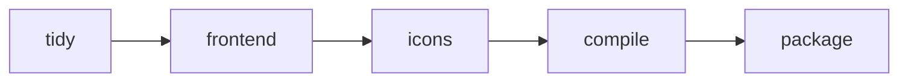

# Build Customization

Wails v3 uses [Task](https://taskfile.dev/) as its build system. This replaces
the custom build logic in v2 and gives you full control over every build step.

## Taskfile.yml Structure

The root `Taskfile.yml` defines the top-level build configuration:

```yaml
version: '3'

includes:
  common: ./build/taskfiles/common.yml
  windows: ./build/taskfiles/windows.yml
  darwin: ./build/taskfiles/darwin.yml
  linux: ./build/taskfiles/linux.yml

vars:
  APP_NAME: MyApp
  OUTPUT_DIR: build/bin

tasks:
  build:
    desc: Build the application
    cmds:
      - task: common:tidy
      - task: common:frontend
      - task: common:icons
      - task: common:compile
      - task: common:package
```

### Key Sections

| Section     | Purpose                                                 |
| ----------- | ------------------------------------------------------- |
| `version`   | Task schema version (use `'3'`)                         |
| `includes`  | Import other Taskfiles for platform-specific or shared tasks |
| `vars`      | Variables available to all tasks                        |
| `tasks`     | Named build steps with commands and metadata            |

## Platform-Specific Taskfiles

Each platform has its own Taskfile containing OS-specific build logic:

```yaml
# build/taskfiles/windows.yml
version: '3'

tasks:
  package:
    desc: Package the Windows application
    cmds:
      - echo "Packaging for Windows..."
      # Platform-specific packaging commands
```

## Task Execution

Run any task directly:

```bash
# Run a top-level task
wails3 task build

# Run a platform-specific task
wails3 task darwin:package

# Run a common task
wails3 task common:tidy
```

The `wails3 build` and `wails3 dev` commands are aliases that delegate to
`wails3 task build` and `wails3 task dev` respectively.

## Passing Parameters

Tasks accept parameters via the `-` flag:

```bash
# Pass a variable to a task
wails3 task build - APP_NAME=MyApp OUTPUT_DIR=./dist

# Or use environment variables
APP_NAME=MyApp wails3 task build
```

## Common Build Process

The typical build pipeline runs these stages in order:



1. **tidy** — Runs `go mod tidy` to clean up dependencies
2. **frontend** — Builds the frontend assets (npm/vite)
3. **icons** — Generates application icons from source images
4. **compile** — Compiles the Go application
5. **package** — Creates the distributable application bundle

## Development Mode

Run `wails3 dev` to start the application in development mode:

```bash
wails3 dev
```

Development mode provides:

- **File watching** — Detects changes to Go and frontend files
- **Hot reload** — Automatically rebuilds and restarts on code changes
- **Vite integration** — Uses Vite's dev server for instant frontend updates

## Configuration

Development behavior is configured in `build/config.yml`:

```yaml
dev_mode:
  frontend_dir: frontend
  watch_dirs:
    - "**/*.go"
    - "frontend/src/**/*"
  ignore_dirs:
    - node_modules
    - .git
    - build
  debounce_ms: 500
```

## Using the Browser for Development

In dev mode, Wails serves the frontend through Vite and opens your default
browser. The browser connects to the Go backend through the Wails runtime,
allowing you to use browser DevTools to inspect frontend code while interacting
with the native application.
